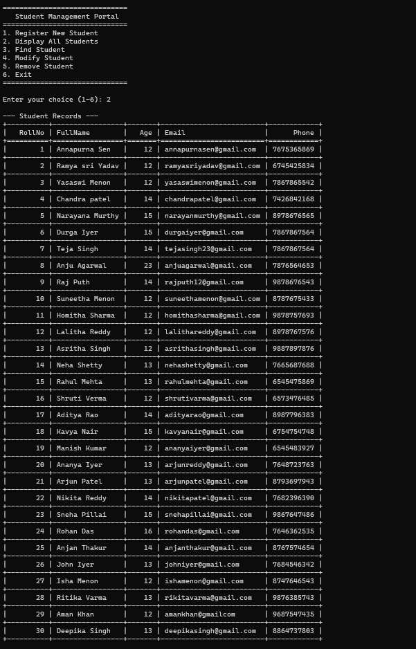

# Student Management System - Python Project

## **Project Overview**
The Student Management System is a **command-line Python application** designed to manage student records efficiently. It allows users to **register, view, search, update, and delete student information** using a simple menu-driven interface.

---

## **Purpose**
This project was created to practice **Python programming**, **file handling**, and **data management using CSV file**. It demonstrates how to build a small-scale CRUD (Create, Read, Update, Delete) application with persistent storage.

---

## **Features**
- **Register New Student** – Add new student details including Roll Number, Name, Age, Email, and Phone.
- **Display All Students** – View all registered students in an organized format.
- **Search Student** – Find a student by Roll Number.
- **Modify Student** – Update existing student details.
- **Remove Student** – Delete student records.
- **Persistent Storage** – All data is saved in a CSV file for long-term storage.

---
## **Project Screenshot**



---

## **How to Run the Project**
1. Clone the repository:
   ```bash
   git clone https://github.com/yasaswi799/Student-Management-System-Python.git
